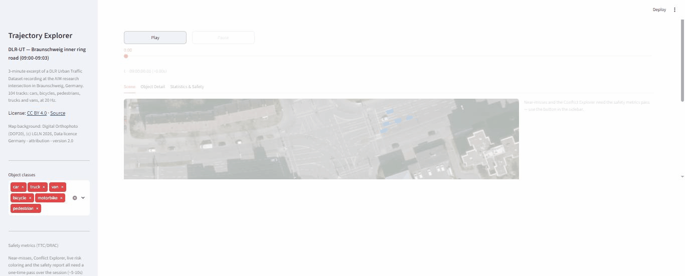

# Trajectory Explorer

Interactive Streamlit demo for exploring vehicle/pedestrian trajectory
datasets, starting with the **DLR Urban Traffic Dataset (DLR-UT)** — recorded
by fixed cameras mounted at a real intersection in Braunschweig, Germany —
plus SMoS-style safety metrics (TTC/DRAC) for identifying near-miss
conflicts.

Built on top of [`tasi`](https://pypi.org/project/tasi/), DLR's trajectory
analysis library.



## Features

- **Animated playback** of a 3-minute recording (104 tracks: cars, trucks,
  vans, bicycles, pedestrians) over a real georeferenced aerial photo of the
  intersection, with play/pause and a scrubber.
- Vehicles rendered as **oriented polygons at their true recorded size**
  (length/width/heading), not generic markers.
- **On-demand safety metrics**: a one-time pairwise TTC (time-to-collision)
  / DRAC (deceleration-to-avoid-crash) pass, with a live progress bar —
  deliberately not run automatically on load, since it's only needed for
  one part of the app.
  - Near-miss counter and a **Conflict Explorer** that jumps playback to a
    conflict's worst moment.
  - Live risk coloring (green/amber/red) of vehicles by current TTC.
  - Downloadable Markdown safety report + CSV conflict ranking.
- **Statistics tab**: speed/acceleration distributions by class, traffic
  flow over time, and a spatial density heatmap.
- Per-object detail view (speed/acceleration/heading over time) and a
  filtered-trajectory CSV export.

## Running locally

The DLR-UT trajectory data itself isn't in this repo (it's a third-party
licensed dataset, not ours to redistribute) — fetch it from Zenodo first:

```bash
uv sync

# downloads the DLR-UT recording from Zenodo via `tasi` (~460MB, cached in
# data_cache/, gitignored), then cuts the 3-minute sample the app uses
uv run python scripts/download_dlr_ut.py
uv run python scripts/fetch_sample_data.py

uv run streamlit run app.py
```

Opens at `http://localhost:8501` by default. The aerial background photo
*is* bundled (`sample_data/dlr_ut/orthophoto.jpeg`, ~130KB, our own asset
from a separate open-data source) — only the trajectory CSV needs fetching.

## Project layout

Standard `src` layout — `trajectory_explorer` is an installable package
under `src/`, kept separate from data assets and dev scripts at the repo
root.

```
app.py                          # Thin entry point for `streamlit run app.py`
src/trajectory_explorer/
    app.py                       # Streamlit orchestration: sidebar, playback, tabs
    data/                        # Dataset registry, cached loading, CRS conversion
    analysis/                    # Kinematics, aggregate stats, TTC/DRAC, risk levels
    viz/                         # pydeck scene/heatmap builders, Plotly charts, colors
scripts/                        # Data/orthophoto fetch scripts (run once, see above)
sample_data/                    # Aerial background photo (bundled); trajectory CSV
                                # lands here too, once fetched -- gitignored
```

## Data & licenses

- Trajectories: [DLR Urban Traffic Dataset](https://zenodo.org/records/20919480),
  CC BY 4.0. Not redistributed in this repo — run the two fetch scripts
  above to get it directly from Zenodo.
- Aerial background: Digital Orthophoto (DOP20) from
  [LGLN Niedersachsen Open Data](https://opendata.lgln.niedersachsen.de/),
  (c) LGLN 2026, Data licence Germany – attribution – version 2.0.

## Notes

- TTC/DRAC use a simplified straight-line, constant-velocity model (not
  heading/bounding-box aware) — `tasi` 0.15.4 ships PET but not TTC/DRAC, so
  these are implemented from scratch in
  `src/trajectory_explorer/analysis/interaction.py`.
- Not yet deployed to Streamlit Community Cloud; runs locally for now.
